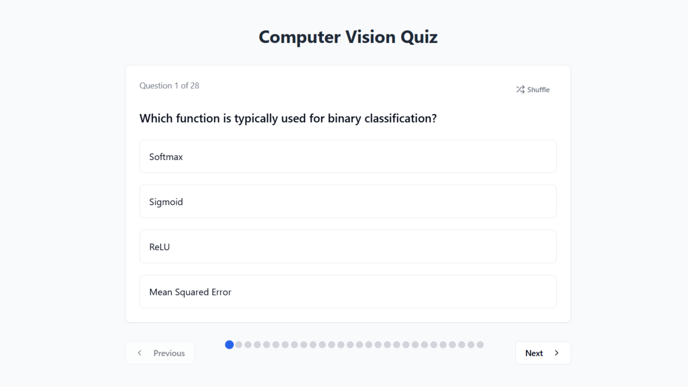

# Computer Vision Quiz App

A dynamic and interactive quiz application focused on computer vision and deep learning concepts, built with Next.js and React.

## Features

- **Multiple Question Types**: Supports both multiple-choice questions and true/false questions
- **Interactive Card Interface**: Questions and answers are displayed on flippable cards
- **Visual Feedback**: Color-coded feedback for correct and incorrect answers
- **Detailed Explanations**: Each answer comes with a detailed explanation
- **Randomized Questions**: Questions are shuffled for a different experience each time
- **Flexible Navigation**: Navigate through questions using arrows or direct selection

- **Responsive Design**: Works on desktop and mobile devices

## Demo

[View Live Demo](https://v0-computer-vision-quiz-app.vercel.app/)

